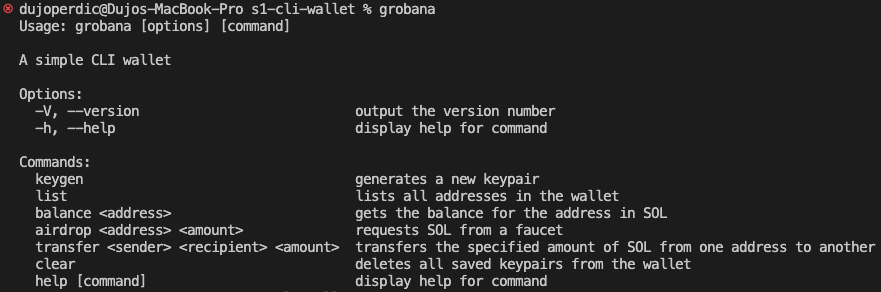

# Grobana

This project requires [Bun](https://bun.sh) to work.

To install dependencies run at the root of the project:

```bash
bun i
```

To install the cli run at the root of the project:

```bash
npm i -g
```

Grobana should now be installed, to use the cli and list all of the commands run:

```bash
grobana
```

The output should look like this:


